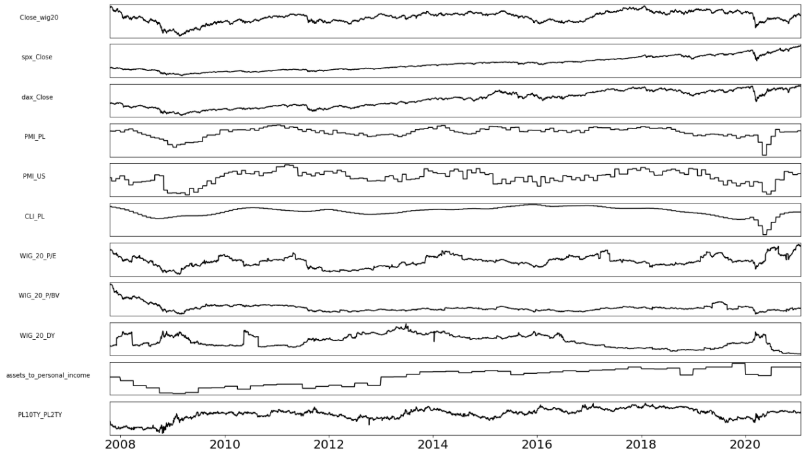

# Forecasting changes on the stock

The aim of the project was to forecast changes on the stock exchange, i.e. decrease or increase in the WIG20 index in the interval of daily, weekly, monthly, 6 months and a year. WIG20 is a stock exchange index of 20 largest companies listed on the Warsaw Stock Exchange. Selected variables relate to Poland, as well as the United States and Germany, because our economy is dependent on them and if there are decreases on them, they appear on our stock exchange. The variables that have been chosen come from the technical and fundamental analysis.

Feature Importance was checked for different intervals. Models evaluated using F1 Score and AUC.